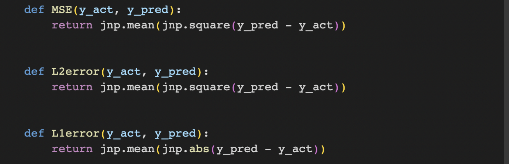
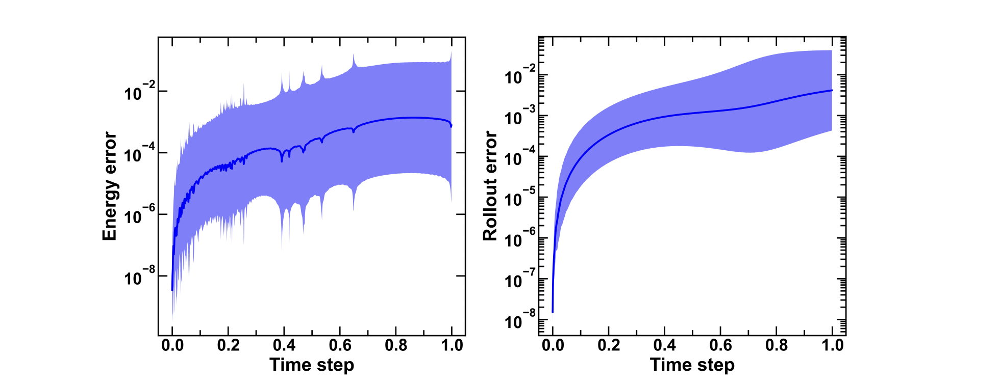
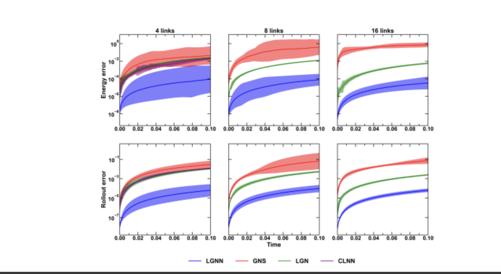
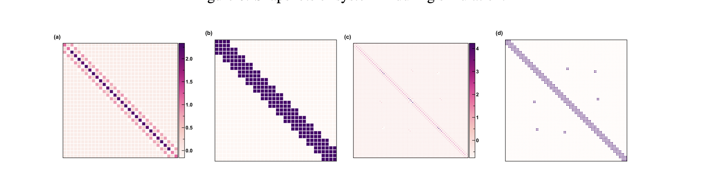
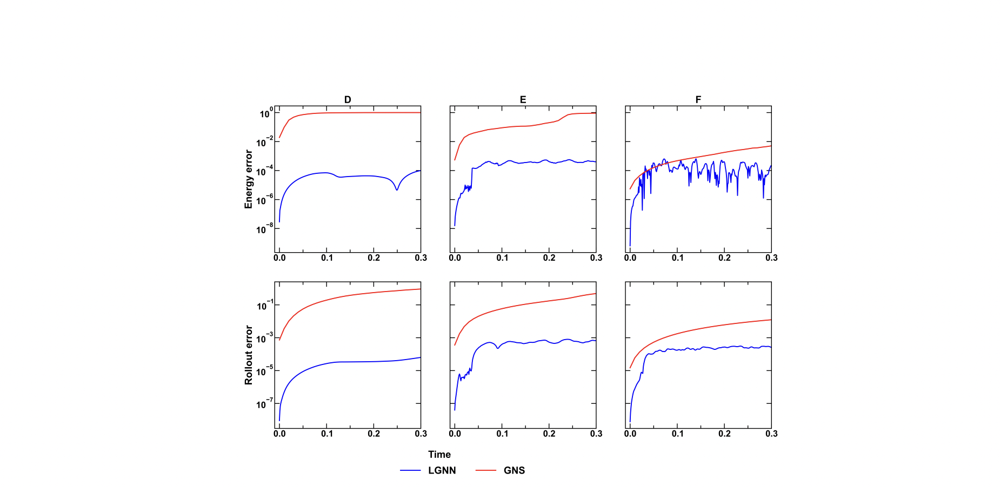
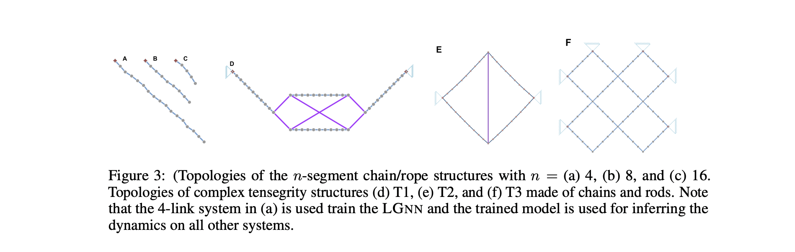
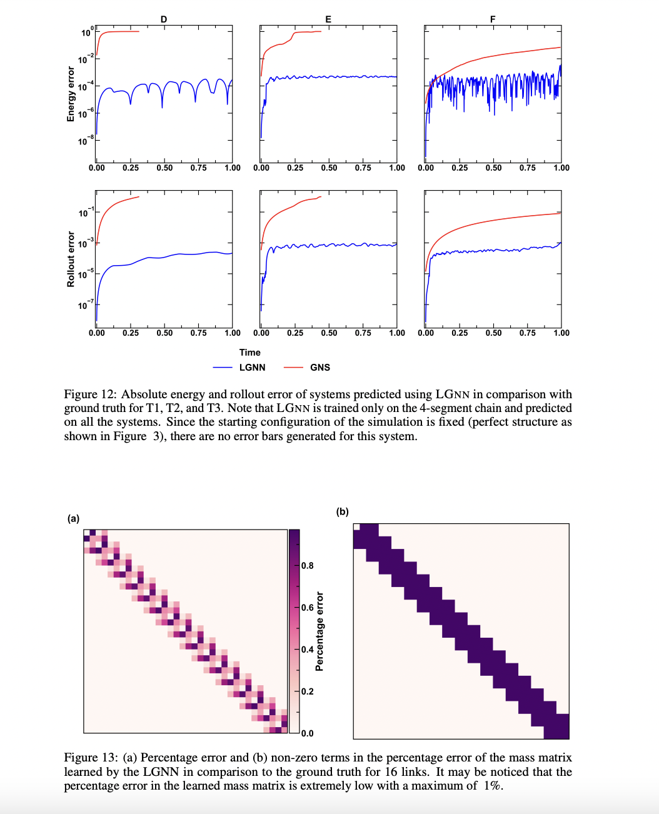
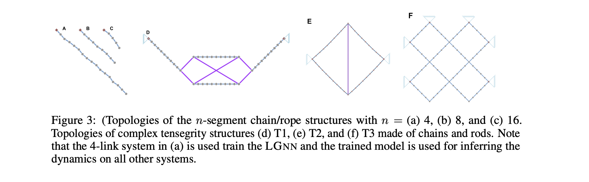

# Dynamics with LGNN Paper(Including sample Visualizations and Code)

Paper: https://arxiv.org/pdf/2209.11588.pdf

Code: https://github.com/M3RG-IITD/rigid_body_dynamics_graph.git

Content

1. [Intro to Dynamics with Lagrangian Graph Neural Network](#1-intro-to-the-paper)

    1.1 [Summary of the Paper](#11-Summary-of-the-paper)
 
    1.2 [Training & Learning Functions](#12-Training-and-Learning-Functions)
  
2. [Examples of LGNN Implementation & Outputs](#2-Example-of-LGNN-Implementation-and-Outputs) (** Example Code and Visualizations**)

     2.1 [Implementing the Graph Based Neural Network Architecture](#21-Implementing-the-Graph-Based-Neural-Network-Architecture)

     2.2 [Initializing and Training Neural Models](#22-Initializing-and-Training-Neural-Models)

     2.3 [Data Storage and Loading](#23-Data-Storage-and-Loading)
  
3. [Inputs & Outputs of the Code](#3-Inputs-and-Outputs-of-the-Code)
  
-----

## 1. Intro to the Paper

We see that Lagrangian Graph Neural Networks are tested to see how well 
they can learn the ability of dynamic systems and see how it can also mimic it. They 
use a simulation model with different neural networks and various amounts of collected analysis. 
LGNN use a graph structure so they are quite unique in the results they provide. 
In the paper, we see them compare the performances of LGNN with other systems and test it by seeing how well it 
can measure energy violation and more predictions. LGNN does comparatively better 
than the other models in terms of mimicking 
the dynamics of the physical system and it is able to simulate more complex systems 
even with simpler models. 
In these comparisons, LGNN shows superior capabilities in mimicking the intricate 
dynamics of physical systems when compared to alternative models. What sets LGNN apart is its aptitude for handling complex systems, even with relatively simpler models, exhibiting a remarkable ability to accurately simulate their behaviors. Overall, the research investigates LGNN's impact in mimicking the dynamics of complex systems, emphasizing its comparative advantages over existing models.


### 1.1 Summary of the Paper

LNNs and HNNs are neural networks which are comparatively better than other neural models when analyzing physcial systems.

These neural networks primarily work to understand the dynamic of physical systems, mostly of things like pendium and other simple systems.

However the equations that help also show Lagrangian graph Neural Networks can have constraints included within them. This is where we have to us LGNN to demonstrate the dynamics of the physical systems. LGNN helps reduce the number of errors we find in the constraints of the equations, which is very much relevent for more difficult equations and systems.

Lagrangian graph Neural Networks works to create graphs to represent the physcial systems, which as compared to other neural netowrks is significantly different.

### 1.2 Training and Learning Functions

-Training function: update the parameters of LGNN and design it for the physical system to test for the effectivness in demonstrating and graphing dynamics. 
Firstly, it initializes the neural network's parameters, often leveraging specific graph-based architectures to represent dynamic systems. Then, it employs iterative processes, executing forward passes to predict system dynamics while adjusting parameters through backpropagation.
During training, the model optimizes its performance by minimizing a defined loss function, which quantifies the disparity between predicted and actual system behaviors. This process involves fine-tuning the network's weights and biases to enhance its ability to accurately simulate and mimic the dynamics of the targeted complex systems.


-Learning/Objective function: include constraints and LGNN methodologies to foreshadow the behavior of the dynamics and how it would be on a graph such as one with LGNN. 
The main purpose is optimizing parameters to minimize a specific loss metric, often rooted in physics-based principles or system dynamics. This function aims to enhance the network's ability to accurately capture the behavior of the dynamic system under study.
This function encompasses minimizing the difference between predicted and observed system states or properties, such as energy conservation or predictive accuracy. The learning function guides the network's adjustments during training, aligning its predictions closer to the actual behavior of the complex system being simulated.



-How do they ensure the constraint is being satisfied: we check for this by seeing how the LGNN identifies the dynamics of the fluids or object by using methodologies of Lagrangian. 

-Smoothness or divergence-free: by using the same techniques as with testing for smoothness/divergence free of other principles we use techniques that will show the smoothness of the networks and its foreshadowed results. we check for divergence by seeing the foreshadowed results of the physical system and comparing it with proven divergence free networks. 

-Constraints - They are so far limited to very simple physical models and are yet to be able to analyze higher-level neural models.

----
### 2. Example of LGNN Implementation and Outputs

#### 2.1 Implementing the Graph Based Neural Network Architecture

The code below represents the architecture that is being designed to represent and reflect the dynamics of the physical systems. It helps introduce the concept of LGNN and how this neural network can support in demonstrating dyanmics of the physcial systems.

Firstly, the code below introduces the main purpose of what LGNN does, using graph based approach to show the dynamics of the systems. It does this with the "GraphEncodeNet" class which inputs in a graph and helps create a structure to show and reflect the dyanmics of the systems.

Then, we see that throughout the paper LGNN are supposed to learn to embed different elements of the systems like sharp edges, nodes, etc. The code works to accomplish this by having an "embedding_fn" function, which aims to include different needed portions of the graph.

it gives another example with a system and demonstrates its kenetic energy to show the inertia that is put through the rigid segments. goes on to also address the potential energy of the system.

They analyze the effectiveness of LGNN on numerous models like the "4-link segment, 8- link segment & 16-link segment". When looking at rollout energy and energy violation LGNN was able to detect in the 4-link segment but, not on the 8-link or 16-link segment. 

Regardless, the above shows that LGNN is able to effectively learn the system habits and performance.

So, we see that if LGNN is trained on smaller systems like the 4-link systems it can, eventually, learn the same needed information for larger systems like 8-link and 16-link systems.

But, we see the constraints of LGNN play into affect when different sizes and bases are used. LGNN is still good at analyzing the system but it does still carry constraints due to its simple physical model.

Lagrangian graph Neural Networks is very universal as it is able to learn very interesting facts about the system like its size, data capacity, and overall structure. It does this by being trained on con-current systems, and it continues to learn about physical systems.

Anyhow, LGNN is a very valuable neural network for computer visualization as it can understand most dynamics that are performed by the physical system, and this neural network can simulate many applicable structures.

Also, on the above note, this neural network might be well advised to fluid dynamics as its structure works to analyze dynamic movements.

They go on to continue testing various segments using different constraints... ie. (complex system example paragraph.)

Gives different examples, specifically with drag force and how it applies to all nodes at equal pressure.

Provided numerous graphs that all show the correlation between time step and absolute/energy/rollout error. LGNN was only trained on 
the "4-link chain and predicted on all the systems" this goes to show how LGNN is quite effective in its tasks and abilities. 

LGNN was able to identify the percantage error and non zero terms in figure 13, graphs a & b, even though the mass matrix was relatively at 1%. 
This can be seen in the below image as well. As shown in image, LGNN produces similar energy and rollout error while the time steps are connected. This helps show us that LGNN is very effecive at maintaining balance with its results and predictions, adding on to its positives.



This code aligns with the theoretical concepts of LGNN by implementing the graph structures and creating functions to include important features for the graph that can demonstrate the dynamics of the physical systems as shown in above image as well.

A very important segment of this code is the function that helps create parameters to organize the code, "params", and "forward_pass" are examples of the functions that support and create parameters for the neural networks. These parameters are also trained and applied when we see the dynamics of the system being applied.

```python

from functools import partial

import jax
import jax.numpy as jnp
import numpy as np
from jax import grad, jit, lax, random


class GraphEncodeNet():
    """
    """

    def __init__(self, embedding_fn, model_fn, final_fn, message_passing=1):
        self.message_passing = message_passing
        self._encoder = GraphMapFeatures(
            embedding_fn('EdgeEncoder'),
            embedding_fn('NodeEncoder'),
            embedding_fn('GlobalEncoder'))
        self._propagation_network = GraphNetwork(
            model_fn('EdgeFunction'),
            model_fn('NodeFunction'),
            model_fn('GlobalFunction'), aggregate_edges_for_globals_fn=lambda *x: jnp.array([0.0]))
        self._final = GraphNetwork(
            final_fn('EdgeFunction'),
            final_fn('NodeFunction'),
            final_fn('GlobalFunction'), aggregate_edges_for_globals_fn=lambda *x: jnp.array([0.0]))

    def __call__(self, graph):
        output = self._encoder(graph)
        for _ in range(self.message_passing):
            output = self._propagation_network(output)
        output = self._final(output)
        return output


def cal(params, graph, mpass=1):
    ee_params = params["ee_params"]
    ne_params = params["ne_params"]
    e_params = params["e_params"]
    n_params = params["n_params"]
    g_params = params["g_params"]

    def embedding_fn():
        def edge_fn(nodes):
            out = jnp.hstack([v for k, v in nodes.items()])

            def fn(out):
                return forward_pass(ne_params, out, activation_fn=SquarePlus)
            out = jax.vmap(fn)(out)
            return {"embed": out}

        def edge_fn(edges):
            out = edges["dij"]
            out = jax.vmap(lambda p, x: forward_pass(p, x.reshape(-1)),
                           in_axes=(None, 0))(ee_params, out)
            return {"embed": out}
    return (edge_fn, node_fn, None)

    def message_passing_fn():

        def edge_fn(edges, sent_attributes, received_attributes, global_):
            out = jnp.hstack([edges["embed"], sent_attributes["embed"],
                              received_attributes["embed"]])
            out = jax.vmap(forward_pass, in_axes=(None, 0))(e_params, out)
            return {"embed": out}

        def node_fn(nodes, sent_attributes, received_attributes, global_):
            out = jnp.hstack([nodes["embed"], sent_attributes["embed"],
                              received_attributes["embed"]])
            out = jax.vmap(forward_pass, in_axes=(None, 0))(n_params, out)
            return {"embed": out}
        return (edge_fn, node_fn, None)

    def final_fn():
        def node_fn(*x):
            return x[0]

        def edge_fn(*x):
            return x[0]

        def global_fn(node_attributes, edge_attribtutes, globals_):
            return forward_pass(g_params, node_attributes["embed"].reshape(-1))

        return (edge_fn, node_fn, global_fn)

    net = GraphEncodeNet(embedding_fn, message_passing_fn,
                         final_fn, message_passing=mpass)

    graph = net(graph)

    return graph
```

#### 2.2 Initializing and Training Neural Models

The below code represents the neural model's file, which includes all functions that help train and initialize the neural network models. It especially shows how we can work with and build neural network models that relate to problems for physical related equations/questions. It models the dynamics of the physical systems and helps show how neural networks can be represented.

First, the code initilizes the Multi layer perceptron, which introduces and genrates the biases of the layers and its sizes. It does this via gaussian methods.

Then, we see that there are two functions activated, SqaurePlus and ReLU, which are used in neural networks to show constraints.

The code also includes two loss functions, MSE and L2error, which measure the difference between the actual and predicted values.

They analyze the effectiveness of LGNN on numerous models like the "4-link segment, 8- link segment & 16-link segment". When looking at rollout energy and energy violation LGNN was able to detect in the 4-link segment but, not on the 8-link or 16-link segment.

Regardless, the above shows that LGNN is able to effectively learn the system habits and performance.

So, we see that if LGNN is trained on smaller systems like the 4-link systems it can, eventually, learn the same needed information for larger systems like 8-link and 16-link systems.

Physical systems such as 8-link system, 10-link system, and tensegrity structure are used to visualize the physical systems and models that are already trained.
These systems help show us the difference in the output/predictions between LGNN, GNS, LGN, and CLNN. As we can see, the LGNN results produce the least amount of energy and rollout error. This shows us that it is quite effective in reducing the errors it makes in simulations.



The implementation involves structuring the neural network architecture around a graph representation. This graph captures the relationships among elements within a dynamic system, with nodes representing entities like particles or components, and edges encoding their interactions or dependencies.
LGNN's framework involves encoding physical principles or system dynamics into the graph structure, incorporating elements such as 
conservation laws, interactions, or constraints as graph attributes. During training, the model processes information across this graph, 
iteratively updating node and edge features through message passing, aggregating information from neighboring nodes, and adjusting parameters to simulate system dynamics.
By utilizing graph-based operations like graph convolutions or attention mechanisms, LGNN iteratively refines its understanding of 
the system's behavior, capturing the temporal evolution and interactions among its components. This implementation facilitates the 
network's ability to learn and predict complex system dynamics, enabling it to simulate and mimic the behaviors of intricate physical 
systems.

But, we see the constraints of LGNN play into affect when different sizes and bases are used. LGNN is still good at analyzing the system but it does still carry constraints due to its simple physical model.

Lagrangian graph Neural Networks is very universal as it is able to learn very interesting facts about the system like its size, data capacity, and overall structure. It does this by being trained on con-current systems, and it continues to learn about physical systems.

Based on the overall background of the paper, we see that this code is very relevant in building and training the neural network models, especially MLP's(Multi-Layer Perceptron), where we see how these neural networks can possibly predict the dynamics of the physical systems.

```python
from functools import partial

import jax
import jax.numpy as jnp
from jax import lax, random, vmap


def initialize_mlp(sizes, key, affine=[False], scale=1.0):
    """ Initialize the weights of all layers of a linear layer network """
    keys = random.split(key, len(sizes))
    # Initialize a single layer with Gaussian weights -  helper function
    if len(affine) != len(sizes):
        affine = [affine[0]]*len(sizes)
    affine[-1] = True

    def initialize_layer(m, n, key, affine=True, scale=1e-2):
        w_key, b_key = random.split(key)
        if affine:
            return scale * random.normal(w_key, (n, m)), 0 * random.normal(b_key, (n,))
        else:
            return scale * random.normal(w_key, (n, m)), scale * random.normal(b_key, (n,))
    return [initialize_layer(m, n, k, affine=a, scale=scale) for m, n, k, a in zip(sizes[:-1], sizes[1:], keys, affine)]


def SquarePlus(x):
    return lax.mul(0.5, lax.add(x, lax.sqrt(lax.add(lax.square(x), 4.))))


def ReLU(x):
    """ Rectified Linear Unit (ReLU) activation function """
    return jnp.maximum(0, x)


def layer(params, x):
    """ Simple ReLu layer for single sample """
    return jnp.dot(params[0], x) + params[1]


def forward_pass(params, x, activation_fn=SquarePlus):
    """ Compute the forward pass for each example individually """
    h = x

    # Loop over the ReLU hidden layers
    for p in params[:-1]:
        h = activation_fn(layer(p, h))

    # Perform final traformation
    p = params[-1]
    h = layer(p, h)
    return h

# Make a batched version of the `predict` function


def batch_forward(params, x, activation_fn=SquarePlus):
    return vmap(partial(forward_pass, activation_fn=activation_fn), in_axes=(None, 0), out_axes=0)(params, x)


def MSE(y_act, y_pred):
    return jnp.mean(jnp.square(y_pred - y_act))


def L2error(y_act, y_pred):
    return jnp.mean(jnp.square(y_pred - y_act))


def L1error(y_act, y_pred):
    return jnp.mean(jnp.abs(y_pred - y_act))


def batch_MSE(ys_act, ys_pred):
    return vmap(MSE, in_axes=(0, 0), out_axes=0)(ys_act, ys_pred)


def loadmodel(filename):
    model, metadata = loadfile(filename)
    if "multimodel" in metadata:
        params = {k: _makedictmodel(v) for k, v in model.items()}
    else:
        params = _makedictmodel(model)
    return params, metadata


def _makedictmodel(model):
    params = []
    for ind in range(len(model)):
        layer = model[f'layer_{ind}']
        w, b = layer["w"], layer["b"]
        params += [(w, b)]
    return params


def savemodel(filename, params, metadata={}):
    if type(params) is type({}):
        m = {k: _makemodeldict(v) for k, v in params.items()}
        metadata = {**metadata, "multimodel": True}
    else:
        m = _makemodeldict(params)
    savefile(filename, m, metadata=metadata)


def _makemodeldict(params):
    m = {}
    for ind, layer in enumerate(params):
        w, b = layer
        w_, b_ = jnp.array(w), jnp.array(b)
        m[f'layer_{ind}'] = {'w': w_, 'b': b_}
    return m


def _pprint_model(params, indent=""):
    for ind, layer in enumerate(params):
        w, b = layer
        print(
            f"{indent}#Layer {ind}: W ({w.shape}), b({b.shape}),  {w.shape[1]} --> {w.shape[0]}")


def pprint_model(params, Iindent=""):
    if type(params) != type({}):
        _pprint_model(params, indent=Iindent)
    else:
        for key, value in params.items():
            print(Iindent + ">" + key)
            indent = Iindent + "-"
            pprint_model(value, Iindent=indent)

```

#### 2.3 Data Storage and Loading

The paper gives another example with a system and demonstrates its kinetic energy  to show the inertia that is put through the rigid segments. goes on to also address the potential energy of the system.

Anyhow, LGNN is a very valuable neural network for computer visualization as it can understand most dynamics that are performed by the physical system, and this neural networks can simulate many applicable structures.

The code below refers to two functions, the loadfile and savefile. The loadfile function reads data from a specificed file, whereas the savefile function saves that date with the metadata for the file.

The primary function of this code is to effectively store and host data for the molecular dynamics trajectory data which is currently in file format, hence the need for these functions which can read the files.

These functions are very effective at visulizing the molecular dynamics of the systems and simulations especially in Ovito which is what the file format is in. The functions help show information about how many particles, positions, forces, and velocities are present in the system.

```python

import pickle

import jax.numpy as jnp


def loadfile(filename, verbose=False):
    if verbose:
        print(f"Loading {filename}")
    return pickle.load(open(filename, "rb"))


def savefile(filename, data, metadata={}, verbose=False):
    if verbose:
        print(f"Saving {filename}")
    pickle.dump((data, metadata), open(filename, "wb+"))


def save_ovito(filename, traj, species=None, lattice=None, length=None, insert_origin=False):
    """Save trajectory as ovito xyz file.

    Args:
        filename (string): File path.
        traj (list of states): Trajectory.
    """
    print(f"Saving ovito file: {filename}")
    with open(filename, "w+") as ofile:
        for state in traj:
            N, dim = state.position.shape
            if species is None:
                species = jnp.array([1]*N).reshape(-1, 1)
            else:
                species = jnp.array(species).reshape(-1, 1)

            hinting = f"Properties=id:I:1:species:R:1:pos:R:{dim}:vel:R:{dim}:force:R:{dim}"
            tmp = jnp.eye(dim).flatten()
            if length is not None:
                lattice = " ".join(
                    [(f"{length}" if i != 0 else "0") for i in tmp])
                Lattice = f'Lattice="{lattice}"'
            if lattice is not None:
                Lattice = f'Lattice="{lattice}"'
            data = jnp.concatenate(
                [species, state.position, state.velocity, state.force], axis=1)
            if insert_origin:
                N = N + 1
                data = jnp.vstack([data, 0*data[1]])
            str_ = f"{N}" + f"\n{Lattice} {hinting}" + f" Time={state.time}\n"
            ofile.write(str_)
            for j in range(N):
                line = "\t".join([str(item) for item in data[j, :]])
                str_ = f"{j+1}\t" + line + "\n"
                ofile.write(str_)
```
----

Also, on the above note, this neural networks might be well adversed to fluid dynamics as its structure works to analyze dyanmic movements.

They go on to continue testing various segments using different constraints... ie. (complex system example paragraph.)

Gives different examples, specifcally with drag force and how it applies to all nodes at equal pressure.

Different sizes are used for LGNN, in order to get the fully connected feed to apply to embedding and passing. Linear layer and hidden layer. In order to embed the nodes they often use Linear transformations which helps effectively integrate the nodes. 



The systems and networks are trained very specifically, where most often, 75% of the data is for training purposes while 25% is for 
validating the data. 

Specifics for pages and continuation from first segment above

In paragraph 2, we can see the dynamics of physical systems and how Lagrangian graph Neural Networks goes in depth to work with them. 
It shows how the systems move and also shows its correlation to equations that can represent such movements.

In order to show the objects change in position and velocity LGNN uses energy and force based methods to articulate the such needed 
info on position and velocity. To represent above, Lagrangian is an example of energy based method. It helps significantly when we are analyzing the systems current position and how the systems develop over time. 
We can see an example of this below. 



LGNN can also help create equations that related to position, velocity, motion and more to help show the development of the
physical systems over time.
force based methods are also used as a part of LGNN which analyzes how objects can move and how such systems can be shown via 
compelx equations, which however, come with this own errors and constraints that LGNN is good at overcoming and looking past.

To this end, the LGNN is very useful in understanding and comparing the dynamics of complex systems that require neural networks 
which can work past constraints and errors. 

### 3. Inputs and Outputs of the Code

Characteristics produced from inputs that are in the output:

-Nodes

-Edges

-System-Level information

-Interactions between the nodes and edges

The output graphs will show all that we learned about the dynamics of the paper by incorporating the above information onto the graph helping us learn what is going on with the simulation.

Inputs:

-One input is the graphs which are incorporated into the code which show only the fundamental concept of the physical system with no additional attributes.

The graphs are the representation of the systems and basically how the data is shown to begin with. It is very relevent and important as it connects with the papers overall topic of using the graphs to model physical systems.

-Another input could be the model parameters, "params" which has a bunch of different parametrs to help embed the nodes, and these parameters are learned during the training stage.


The below image represents the numerous inputs for the graph. These inputs are serving as paramaters which will be tested. All the parameters are organized in a dictionary and they are very important for the function of the neural network. In the paper, they emphasize that parametrization includes much learning which goes on to capture the dynamics and simulation of the system. The code and below images helps us do this by assigning the parmeters to learn from the data and improve the outputs on the graph and improve the prediction power.




Outputs:




-The output is the modified graphs with the nodes, edges, and system information.

There is a new graph that is produced which has the attributes like the edges and nodes incorporated into it, and these graphs represent the behavior of the system. This connects back to the papers overall topic of incorporating attributes into the LGNN graphs to identify the behavior and simulation of the system.

It helps show the way that LGNN is used, like in the paper, basically producing graph models to represent the physcial systems. The paper also emphasizes the need to embed attributes to the graph to best learn what is being simulated, the paper does this by capturing the important features of the systems dynamics to show the LGNN.

This connects back to the paper completely as it shows the inputs and outputs as dicussed with the use of LGNN. Especially by demonstrating the input of a graph with no attributes and then outputting a graph with attributes like edges and nodes to demonstrate what is happening with the physical system.


Input:

Let's look at the below input/chain structure used to train the LGNN graphs


We are given the topologies of the chains and see that the 4-link system(a) is used to train the LGNN graph and all other systems. 
Each node on the line/chain can be given a coordinate, as below. 

(A)
```
A = [0, 0]
B = [1, -1]
C = [2, -2]
D = [3,-3]
E  = [4, -4]
F = [5, -5]
G = [6, -6]
H = [7, -7]
I = [8, -8]
J = [9, -9]
K = [10, -10]
L = [11, -11]
M = [12, -12]
N = [13, -12]
O = [14, -13]
P = [15, -13]

```

As we can see above the chain is almost linear until the Point M & N. 

After we read the chain from the files it will be in following order:

```
nodes = [A, B, C, D, E, F, G, H, I, A, A, A, A, A, A, A, A, A, A, ]
```


----

Colab Link: https://colab.research.google.com/drive/1rErUFvWDCJAXMhRg4RABXACigZw00vAi?usp=sharing
