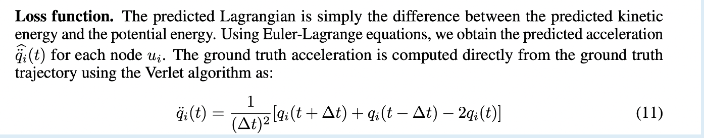

# Dynamics with LGNN Paper

Content

1. [Intro to Dynamics with Lagrangian Graph Neural Network](#1-intro-to-the-paper)

  1.1 [Summary of the Paper]()
 
  1.2 [Training & Learning Functions]()
  
  1.3 [Examples of LGNN Implementation & Outputs]() **Visualizations**
  
  1.4 [Inputs & Outputs of the Code]()

-----

## 1. Intro to the Paper

We see that Lagrangian Graph Neural Networks are tested to see how well 
they can learn the ability of dynamic systems and see how it can also mimic it. They 
use a simulation model with different neural networks and various amounts of collected analysis. 
LGNN use a graph structure so they are quite unique in the results they provide. 
In the paper, we see them compare the performances of LGNN with other systems and test it by seeing how well it 
can measure energy violation and more predictions. LGNN does comparatively better 
than the other models in terms of mimicking 
the dynamics of the physical system and it is able to simulate more complex systems 
even with simpler models. 
In these comparisons, LGNN showcases superior capabilities in mimicking the intricate 
dynamics of physical systems when compared to alternative models. What sets LGNN apart is its aptitude for handling complex systems, even with relatively simpler models, exhibiting a remarkable ability to accurately simulate their behaviors. Overall, the research investigates LGNN's impact in mimicking the dynamics of complex systems, emphasizing its comparative advantages over existing models.

### 1.1 Summary of the Paper

LNNs and HNNs are neural networks which are comparatively better than other neural models when analyzing physcial systems.

These neural networks primarily work to understand the dynamic of physical systems, mostly of things like pendium and other simple systems.

However the equations that help also show Lagrangian graph Neural Networks can have constraints included within them. This is where we have to us LGNN to demonstrate the dynamics of the physical systems. LGNN helps reduce the number of errors we find in the constraints of the equations, which is very much relevent for more difficult equations and systems.

Lagrangian graph Neural Networks works to create graphs to represent the physcial systems, which as compared to other neural netowrks is significantly different.

They analyze the effectiveness of LGNN on numerous models like the "4-link segment, 8- link segment & 16-link segment". When looking at rollout energy and energy violation LGNN was able to detect in the 4-link segment but, not on the 8-link or 16-link segment. 

Regardless, the above shows that LGNN is able to effectively learn the system habits and performance.

So, we see that if LGNN is trained on smaller systems like the 4-link systems it can, eventually, learn the same needed information for larger systems like 8-link and 16-link systems.

But, we see the constraints of LGNN play into affect when different sizes and bases are used. LGNN is still good at analyzing the system but it does still carry constraints due to its simple physical model.

Lagrangian graph Neural Networks is very universal as it is able to learn very interesting facts about the system like its size, data capacity, and overall structure. It does this by being trained on con-current systems, and it continues to learn about physical systems.

### 1.2 Training and Learning Functions

-Training function: update the parameters of LGNN and design it for the physical system to test for the effectivness in demonstrating and graphing dynamics
Firstly, it initializes the neural network's parameters, often leveraging specific graph-based architectures to represent dynamic systems. Then, it employs iterative processes, executing forward passes to predict system dynamics while adjusting parameters through backpropagation.
During training, the model optimizes its performance by minimizing a defined loss function, which quantifies the disparity between predicted and actual system behaviors. This process involves fine-tuning the network's weights and biases to enhance its ability to accurately simulate and mimic the dynamics of the targeted complex systems.

-Learning/Objective function: include constraints and LGNN methodologies to foreshadow the behavior of the dynamics and how it would be on a grpah such as one with LGNN. 
The main purpose is optimizing parameters to minimize a specific loss metric, often rooted in physics-based principles or system dynamics. This function aims to enhance the network's ability to accurately capture the behavior of the dynamic system under study.
This function encompasses minimizing the difference between predicted and observed system states or properties, such as energy conservation or predictive accuracy. The learning function guides the network's adjustments during training, aligning its predictions closer to the actual behavior of the complex system being simulated.

-How do they ensure the constraint is being satisfied: we check for this by seeing how the LGNN identifies the dynamics of the fluids or object by using methodologies of Lagrangian. 

-Smoothness or divergence-free: by using the same techniques as with testing for smoothness/divergence free of other principles we use techniques that will show the smoothness of the networks and its foreshadowed results. we check for divergence by seeing the foreshadowed results of the physical system and comparing it with proven divergence free networks. 

-Constraints - They are so far limited to very simple physical models and are yet to be able to analyze higher-level neural models.

### 1.3 Example of LGNN Implementation & Outputs

It gives another example with a system and demonstrates its kenetic energy  to show the inertia that is put through the rigid segments. goes on to also address the potential energy of the system.

Anyhow, LGNN is a very valuable neural network for computer visualization as it can understand most dynamics that are performed by the physical system, and this neural networks can simulate many applicable structures.

Also, on the above note, this neural networks might be well adversed to fluid dynamics as its structure works to analyze dyanmic movements.

They go on to continue testing various segments using different constraints... ie. (complex system example paragraph.)

Gives different examples, specifcally with drag force and how it applies to all nodes at equal pressure.

Physical systems such as 8-link system, 10-link system, and tensegrity structure are using to visualize the physical systems and models that are already trained.

The implementation involves structuring the neural network architecture around a graph representation. This graph captures the relationships among elements within a dynamic system, with nodes representing entities like particles or components, and edges encoding their interactions or dependencies.
LGNN's framework involves encoding physical principles or system dynamics into the graph structure, incorporating elements such as 
conservation laws, interactions, or constraints as graph attributes. During training, the model processes information across this graph, 
iteratively updating node and edge features through message passing, aggregating information from neighboring nodes, and adjusting parameters to simulate system dynamics.
By utilizing graph-based operations like graph convolutions or attention mechanisms, LGNN iteratively refines its understanding of 
the system's behavior, capturing the temporal evolution and interactions among its components. This implementation facilitates the 
network's ability to learn and predict complex system dynamics, enabling it to simulate and mimic the behaviors of intricate physical 
systems.

Different sizes are used for LGNN, in order to get the fully connected feed to apply to embedding and passing. Linear layer and hidden layer. In order to embed the nodes they often use Linear transformations which helps effectively integrate the nodes. 

The systems and networks are trained very specifically, where most often, 75% of the data is for training purposes while 25% is for 
validating the data. 

Provided numerous graphs that all show the correlation between time step and absolute/energy/rollout error. LGNN was only trained on 
the "4-link chain and predicted on all the systems" this goes to show how LGNN is quite effective in its tasks and abilities. 

LGNN was able to identify the percantage error and non zero terms in figure 13, graphs a & b, even though the mass matrix was relatively at 1%. 
This can be seen in below image as well.

Specifics for pages and continuation from first segment above

In paragraph 2, we can see the dynamics of physical systems and how Lagrangian graph Neural Networks goes in depth to work with them. 
It shows how the systems move and also shows its correlation to equations that can represent such movements.

In order to show the objects change in position and velocity LGNN uses energy and force based methods to articulate the such needed 
info on position and velocity. To represent above, Lagrangian is an example of energy based method. It helps significantly when we are analyzing the systems current position and how the systems develop over time. 
We can see an example of this below. 

LGNN can also help create equations that related to position, velocity, motion and more to help show the development of the
physical systems over time.
force based methods are also used as a part of LGNN which analyzes how objects can move and how such systems can be shown via 
compelx equations, which however, come with this own errors and constraints that LGNN is good at overcoming and looking past.

To this end, the LGNN is very useful in understanding and comparing the dynamics of complex systems that require neural networks 
which can work past constraints and errors. 

### 1.4 Inputs & Outputs of the Code

Inputs:

One input is the graphs which are incorporated into the code which show and represent the nodes, edges, and other attributes like system information. 

Another input could be the model parameters, "params" which has a bunch of different parametrs to help embed the nodes, and these parameters are learned during the training stage. 

Outputs:

The graphs with the attributes and characteristics. There are neural network architectures included in the code which will generate the graph with the nodes and edges as mentioned in inputs, which are all produces after training. 
